# 🔄 Plan de Sincronización de Calendario con Apple Calendar

**Objetivo**: Sincronización bidireccional entre On Tour App y calendarios compartidos de Apple Calendar (iCloud).

## 🎯 Alcance del Proyecto

### Funcionalidades
1. **Importar calendario** de Apple Calendar a On Tour
2. **Exportar eventos** de On Tour a Apple Calendar
3. **Sincronización bidireccional** automática
4. **Gestión de conflictos** cuando hay cambios concurrentes
5. **Soporte para calendarios compartidos** (múltiples usuarios)

---

## 🏗️ Arquitectura Propuesta

### Stack Tecnológico

**Frontend (On Tour App)**:
- React + TypeScript
- Configuración de sync en Settings
- UI para seleccionar calendarios a sincronizar

**Backend (Nuevo servicio)**:
- Node.js + Express (ya existe en `/backend`)
- CalDAV Client Library: `tsdav` o `dav`
- Base de datos: Firestore (ya configurada)
- Webhooks para sincronización en tiempo real

**Protocolo**:
- **CalDAV** (Calendar Extensions to WebDAV)
- Compatible con iCloud, Google Calendar, Outlook

---

## 📊 Flujo de Sincronización

### 1. Configuración Inicial


### 2. Sincronización Continua (Bidireccional)

#### **A. Cambios en Apple Calendar → On Tour**

```mermaid
sequenceDiagram
    Apple Calendar->>iCloud: Usuario añade evento
    Backend Poller->>iCloud CalDAV: GET /calendars (cada 5 min)
    iCloud CalDAV-->>Backend Poller: Eventos modificados (ctag)
    Backend Poller->>Firestore: Actualizar eventos
    Firestore->>On Tour App: Notificación real-time
    On Tour App->>User: Mostrar nuevo evento
```



#### **B. Cambios en On Tour → Apple Calendar**


---

## 🔧 Implementación Técnica

### Fase 1: Backend CalDAV Service (2-3 días)

#### 1.1 Instalar dependencias

```bash
cd backend
npm install tsdav uuid ical.js
npm install --save-dev @types/uuid
```

#### 1.2 Crear servicio CalDAV

**`backend/src/services/caldav/caldavClient.ts`**:
```typescript
import { createDAVClient, DAVCalendar, DAVCalendarObject } from 'tsdav';

export class CalDAVClient {
  private client;

  async connect(username: string, password: string) {
    this.client = await createDAVClient({
      serverUrl: 'https://caldav.icloud.com',
      credentials: { username, password },
      authMethod: 'Basic',
      defaultAccountType: 'caldav',
    });
    return await this.client.login();
  }

  async listCalendars(): Promise<DAVCalendar[]> {
    return await this.client.fetchCalendars();
  }

  async getEvents(calendarUrl: string): Promise<DAVCalendarObject[]> {
    return await this.client.fetchCalendarObjects({
      calendar: { url: calendarUrl },
    });
  }

  async createEvent(calendarUrl: string, event: any) {
    const iCalString = this.convertToICS(event);
    return await this.client.createCalendarObject({
      calendar: { url: calendarUrl },
      filename: `${event.uid}.ics`,
      iCalString,
    });
  }

  async updateEvent(calendarUrl: string, event: any) {
    const iCalString = this.convertToICS(event);
    return await this.client.updateCalendarObject({
      calendar: { url: calendarUrl },
      filename: `${event.uid}.ics`,
      iCalString,
    });
  }

  async deleteEvent(calendarUrl: string, eventUid: string) {
    return await this.client.deleteCalendarObject({
      calendar: { url: calendarUrl },
      filename: `${eventUid}.ics`,
    });
  }

  private convertToICS(event: any): string {
    // Convertir evento de On Tour al formato iCalendar
    return `BEGIN:VCALENDAR
VERSION:2.0
PRODID:-//On Tour App//Calendar Sync//EN
BEGIN:VEVENT
UID:${event.uid}
DTSTAMP:${this.formatDate(new Date())}
DTSTART:${this.formatDate(event.start)}
DTEND:${this.formatDate(event.end)}
SUMMARY:${event.title}
LOCATION:${event.location || ''}
DESCRIPTION:${event.description || ''}
STATUS:${event.status?.toUpperCase() || 'CONFIRMED'}
END:VEVENT
END:VCALENDAR`;
  }

  private formatDate(date: Date): string {
    return date.toISOString().replace(/[-:]/g, '').split('.')[0] + 'Z';
  }
}
```

#### 1.3 API Endpoints

**`backend/src/routes/calendarSync.ts`**:
```typescript
import express from 'express';
import { CalDAVClient } from '../services/caldav/caldavClient';
import { authMiddleware } from '../middleware/auth';

const router = express.Router();

// Conectar cuenta de iCloud
router.post('/connect', authMiddleware, async (req, res) => {
  const { email, password } = req.body;
  const userId = req.user.uid;

  try {
    const client = new CalDAVClient();
    await client.connect(email, password);
    const calendars = await client.listCalendars();

    // Guardar credenciales encriptadas en Firestore
    await saveUserCalendarConfig(userId, { email, calendars });

    res.json({ success: true, calendars });
  } catch (error) {
    res.status(500).json({ error: 'Failed to connect to iCloud Calendar' });
  }
});

// Habilitar sincronización para un calendario
router.post('/enable', authMiddleware, async (req, res) => {
  const { calendarId, direction } = req.body; // 'import', 'export', 'bidirectional'
  const userId = req.user.uid;

  await enableSync(userId, calendarId, direction);
  res.json({ success: true });
});

// Sincronización manual (forzar)
router.post('/sync-now', authMiddleware, async (req, res) => {
  const userId = req.user.uid;
  await triggerSync(userId);
  res.json({ success: true });
});

export default router;
```

#### 1.4 Sincronizador en Background

**`backend/src/workers/calendarSyncWorker.ts`**:
```typescript
import cron from 'node-cron';
import { CalDAVClient } from '../services/caldav/caldavClient';
import { db } from '../config/firebase';

// Ejecutar cada 5 minutos
cron.schedule('*/5 * * * *', async () => {
  console.log('[CalDAV Sync] Starting sync job...');
  
  const users = await db.collection('users')
    .where('calendarSync.enabled', '==', true)
    .get();

  for (const userDoc of users.docs) {
    await syncUserCalendar(userDoc.id);
  }
});

async function syncUserCalendar(userId: string) {
  const userConfig = await getUserCalendarConfig(userId);
  const client = new CalDAVClient();
  
  await client.connect(userConfig.email, userConfig.password);
  
  // 1. Pull: iCloud → Firestore
  const remoteEvents = await client.getEvents(userConfig.calendarUrl);
  await syncIncomingEvents(userId, remoteEvents);
  
  // 2. Push: Firestore → iCloud
  const localChanges = await getLocalChanges(userId);
  for (const change of localChanges) {
    if (change.type === 'created') {
      await client.createEvent(userConfig.calendarUrl, change.event);
    } else if (change.type === 'updated') {
      await client.updateEvent(userConfig.calendarUrl, change.event);
    } else if (change.type === 'deleted') {
      await client.deleteEvent(userConfig.calendarUrl, change.event.uid);
    }
  }
  
  console.log(`[CalDAV Sync] User ${userId} synced successfully`);
}
```

---

### Fase 2: Frontend UI (1-2 días)

#### 2.1 Settings Page - Calendar Sync Section

**`src/pages/profile/CalendarSyncSettings.tsx`**:
```typescript
import React, { useState } from 'react';
import { Apple, RefreshCw, Check } from 'lucide-react';

export function CalendarSyncSettings() {
  const [connected, setConnected] = useState(false);
  const [calendars, setCalendars] = useState([]);
  const [syncing, setSyncing] = useState(false);

  const handleConnect = async () => {
    // Modal para solicitar credenciales
    const email = prompt('iCloud Email:');
    const password = prompt('App-Specific Password:');
    
    const response = await fetch('/api/calendar-sync/connect', {
      method: 'POST',
      headers: { 'Content-Type': 'application/json' },
      body: JSON.stringify({ email, password }),
    });
    
    const data = await response.json();
    setCalendars(data.calendars);
    setConnected(true);
  };

  const handleEnableSync = async (calendarId: string) => {
    await fetch('/api/calendar-sync/enable', {
      method: 'POST',
      headers: { 'Content-Type': 'application/json' },
      body: JSON.stringify({ 
        calendarId, 
        direction: 'bidirectional' 
      }),
    });
  };

  return (
    <div className="space-y-6">
      <div className="flex items-center gap-3">
        <Apple className="w-6 h-6" />
        <h2 className="text-xl font-semibold">Apple Calendar Sync</h2>
      </div>

      {!connected ? (
        <button
          onClick={handleConnect}
          className="btn-primary"
        >
          Connect iCloud Calendar
        </button>
      ) : (
        <div className="space-y-4">
          <p className="text-sm text-slate-400">
            ✓ Connected to iCloud
          </p>
          
          <div className="space-y-2">
            <h3 className="font-medium">Select calendars to sync:</h3>
            {calendars.map((cal) => (
              <label key={cal.id} className="flex items-center gap-2">
                <input
                  type="checkbox"
                  onChange={(e) => {
                    if (e.target.checked) {
                      handleEnableSync(cal.id);
                    }
                  }}
                />
                <span>{cal.displayName}</span>
              </label>
            ))}
          </div>

          <button
            onClick={async () => {
              setSyncing(true);
              await fetch('/api/calendar-sync/sync-now', { method: 'POST' });
              setSyncing(false);
            }}
            className="btn-secondary flex items-center gap-2"
          >
            <RefreshCw className={syncing ? 'animate-spin' : ''} />
            Sync Now
          </button>
        </div>
      )}
    </div>
  );
}
```

---

### Fase 3: Gestión de Conflictos (1 día)

**Estrategias**:
1. **Last-Write-Wins**: El cambio más reciente prevalece (simple)
2. **Manual Resolution**: Mostrar conflicto al usuario para decidir
3. **iCloud Master**: iCloud siempre gana (para calendarios compartidos)

**Implementación**:
```typescript
async function resolveConflict(localEvent, remoteEvent) {
  // Comparar timestamps
  if (remoteEvent.lastModified > localEvent.lastModified) {
    // Usar versión de iCloud
    await updateLocalEvent(localEvent.id, remoteEvent);
  } else if (localEvent.lastModified > remoteEvent.lastModified) {
    // Usar versión local
    await updateRemoteEvent(remoteEvent.uid, localEvent);
  } else {
    // Mismo timestamp - posible conflicto
    // Opción 1: Mostrar al usuario
    await showConflictDialog(localEvent, remoteEvent);
    // Opción 2: Merge automático
    const merged = mergeEvents(localEvent, remoteEvent);
    await updateBoth(merged);
  }
}
```

---

## 🔐 Seguridad

### App-Specific Password de iCloud

Para conectar con iCloud CalDAV, los usuarios necesitan generar una **contraseña específica de app**:

1. Ir a [appleid.apple.com](https://appleid.apple.com)
2. Iniciar sesión
3. Seguridad → Contraseñas de app
4. Generar nueva contraseña
5. Usar esa contraseña en On Tour App

**No almacenar contraseñas en texto plano**:
- Encriptar credenciales con AES-256
- Almacenar en Firestore con cifrado
- Usar variables de entorno para claves de cifrado

---

## 📱 Experiencia de Usuario

### Flow de Configuración

1. **Settings > Integrations > Apple Calendar**
2. Click "Connect"
3. Modal: Instrucciones para generar app password
4. Input: Email + App Password
5. Mostrar lista de calendarios disponibles
6. Checkbox para seleccionar cuál(es) sincronizar
7. Dropdown: Dirección de sync (Import/Export/Both)
8. "Enable Sync" button
9. Confirmación + primera sincronización

### Indicadores Visuales

- Badge en eventos: "📱 Synced with Apple Calendar"
- Icono de sync girando durante sincronización
- Último sync timestamp en Settings
- Notificación cuando hay conflictos

---

## 🚀 Roadmap de Implementación

### Sprint 1: Backend Foundation (5 días)
- [ ] Setup CalDAV client library
- [ ] Implementar autenticación con iCloud
- [ ] API endpoints básicos (connect, list calendars)
- [ ] Almacenar config en Firestore

### Sprint 2: Sincronización Unidireccional (5 días)
- [ ] Import: iCloud → On Tour
- [ ] Background worker (polling cada 5 min)
- [ ] Mapeo de campos iCal ↔ On Tour Event
- [ ] Testing con calendario real

### Sprint 3: Sincronización Bidireccional (5 días)
- [ ] Export: On Tour → iCloud
- [ ] Detectar cambios locales (change tracking)
- [ ] Push changes a iCloud
- [ ] Testing completo bidireccional

### Sprint 4: Frontend UI (3 días)
- [ ] Settings page para Calendar Sync
- [ ] Modal de conexión
- [ ] Selector de calendarios
- [ ] Indicadores de estado de sync

### Sprint 5: Conflictos y Refinamiento (3 días)
- [ ] Implementar detección de conflictos
- [ ] UI para resolución manual
- [ ] Logs y debugging
- [ ] Error handling robusto

**Total: ~21 días de desarrollo**

---

## 📋 Checklist de Lanzamiento

### Pre-requisitos
- [ ] Backend API desplegado
- [ ] Firestore configurada
- [ ] Variables de entorno configuradas
- [ ] Documentación de usuario completada

### Testing
- [ ] Test con calendario personal de iCloud
- [ ] Test con calendario compartido (múltiples usuarios)
- [ ] Test de conflictos (edición simultánea)
- [ ] Test de eliminación de eventos
- [ ] Test de eventos recurrentes
- [ ] Performance test (1000+ eventos)

### Documentación
- [ ] Guía de usuario: "Cómo conectar Apple Calendar"
- [ ] FAQ: Troubleshooting común
- [ ] API docs para endpoints de sync
- [ ] Diagrama de arquitectura actualizado

---

## 🔮 Futuras Mejoras

1. **Webhooks en lugar de polling**: iCloud no soporta webhooks nativamente, pero se puede usar **EventKit** en iOS/macOS
2. **Google Calendar sync**: Usar mismo patrón con Google Calendar API
3. **Outlook sync**: CalDAV también funciona con Outlook
4. **Sync selectivo**: Solo sincronizar eventos de tipo "Show"
5. **Custom fields**: Mapear campos personalizados de On Tour a propiedades extendidas de iCal
6. **Offline sync**: Queue de cambios cuando no hay conexión

---

## ⚠️ Limitaciones Conocidas

1. **Polling Delay**: Sync cada 5 min (no instantáneo)
2. **Rate Limits**: iCloud puede limitar requests frecuentes
3. **Auth Complexity**: Usuarios deben generar app password
4. **Campos Personalizados**: On Tour tiene campos que iCal no soporta nativamente (fee, status, etc.)
5. **Attachments**: iCal soporta attachments pero On Tour no (por ahora)

---

## 📚 Referencias

- [CalDAV RFC 4791](https://datatracker.ietf.org/doc/html/rfc4791)
- [iCloud CalDAV Setup](https://support.apple.com/en-us/HT202361)
- [tsdav Library](https://github.com/natelindev/tsdav)
- [iCalendar Format (RFC 5545)](https://datatracker.ietf.org/doc/html/rfc5545)
- [Apple Calendar Server Documentation](https://github.com/apple/ccs-calendarserver)

---

## 🎯 Próximos Pasos Inmediatos

1. **Validar con stakeholders** que CalDAV es la mejor opción
2. **Prototipo rápido** (2-3 días) para validar conectividad
3. **Decidir prioridad** vs otras features
4. **Asignar recursos** de desarrollo

¿Quieres que empiece a implementar alguna fase específica?
