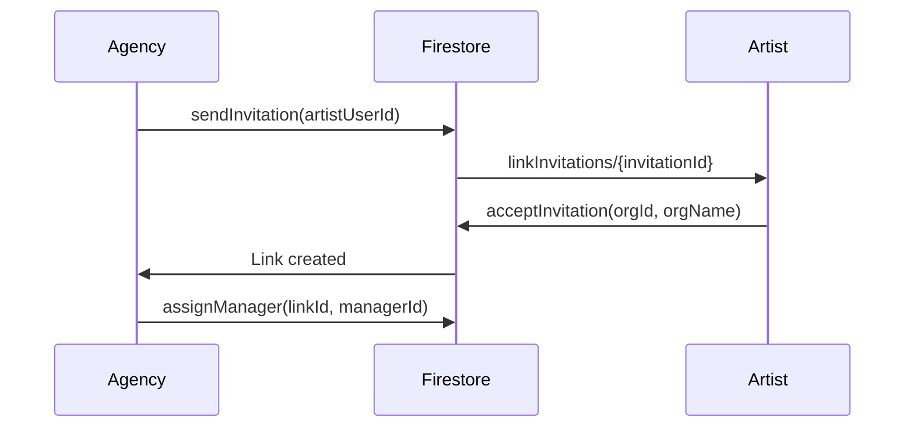

# Multi-Tenancy Architecture for On Tour App

**Status:** ✅ Production Ready (November 2025)  
**Implementation:** Complete with granular permissions and agency-artist linking

---

## Overview

On Tour App implements **organization-based multi-tenancy** where tours, shows, and financial data are shared resources managed by teams. The system supports two organizational types:

- **Agency Organizations**: Manage multiple artists, booking, and commissions
- **Artist Organizations**: Manage tours, shows, and team collaboration

**CURRENT STATE:**
- ✅ Full multi-tenant architecture: `organizations/{orgId}/*`
- ✅ User-scoped personal data: `users/{userId}/*`
- ✅ Role-based access control (RBAC) with granular permissions
- ✅ Agency-Artist linking system with invitations
- ✅ Real-time synchronization across all users
- ✅ Backward compatibility with legacy single-user paths
- ✅ Scalable sub-collections for large datasets
- ✅ Production-ready Firestore security rules

---

## Architecture Overview

### Dual Data Structure

The system uses a **hybrid approach** with both user-scoped and organization-scoped data:

```
users/{userId}/                          # Personal user data
  ├── profile/                          # Personal profile
  ├── preferences/                      # UI preferences
  ├── settings/                         # App configuration
  ├── links/{linkId}                    # Active agency-artist links
  ├── linkInvitations/{invitationId}    # Received invitations (artist)
  ├── sentLinkInvitations/{invitationId} # Sent invitations (agency)
  └── organizations/{orgId}/            # User's org-scoped data
      ├── shows/{showId}                # Shows for this org
      ├── contacts/{contactId}          # Contacts
      ├── finance_snapshots/{snapshotId} # Finance data
      └── calendar_events/{eventId}     # Events

organizations/{orgId}/                   # Shared organization data
  ├── name, type, createdBy, settings   # Org metadata
  ├── members/{userId}                  # Team members with roles
  ├── shows/{showId}                    # Collaborative shows
  ├── finance_snapshots/{snapshotId}    # Shared finances
  │   └── transactions/{txId}           # Nested transactions
  ├── contacts/{contactId}              # Shared contacts
  ├── contracts/{contractId}            # Contracts
  ├── calendar_events/{eventId}         # Team calendar
  ├── invitations/{inviteId}            # Pending invites
  ├── audit_logs/{logId}                # Audit trail
  └── timeline_events/{eventId}         # Activity feed
```

---

## Organization Types

### 1. Artist Organization

**Purpose**: Manage a band/artist's tours, shows, and team

**Key Features**:
- Tour management and show scheduling
- Team collaboration (band members, crew, managers)
- Financial tracking (fees, expenses, settlements)
- Travel logistics and itineraries
- Contract management

**Typical Roles**:
- Owner: Artist/Band leader
- Admin: Tour Manager
- Member: Band members, crew
- Finance: Accountant/Business manager
- Viewer: Support staff

### 2. Agency Organization

**Purpose**: Booking agencies managing multiple artists

**Key Features**:
- Multi-artist management
- Commission tracking per artist
- Link invitations to artists
- Manager assignment to linked artists
- Consolidated booking pipeline

**Typical Roles**:
- Owner: Agency principal
- Admin: Senior booking agents
- Member: Booking agents
- Viewer: Assistants

---

## Role-Based Access Control (RBAC)

### Role Hierarchy

```typescript
type MemberRole = 'owner' | 'admin' | 'finance' | 'member' | 'viewer';
```

| Role | Description | Default Permissions |
|------|-------------|---------------------|
| **Owner** | Full control, can delete org | All permissions |
| **Admin** | Can manage members and settings | All except org deletion |
| **Finance** | Financial data management | Finance read/write/export |
| **Member** | Standard team member | Shows, calendar, contacts (write) |
| **Viewer** | Read-only access | All modules (read-only) |

### Granular Permissions

Each module has specific permissions:

```typescript
type Permission = 
  // Finance
  | 'finance.read' | 'finance.write' | 'finance.delete' | 'finance.export'
  // Shows
  | 'shows.read' | 'shows.write' | 'shows.delete'
  // Calendar
  | 'calendar.read' | 'calendar.write' | 'calendar.delete'
  // Travel
  | 'travel.read' | 'travel.write' | 'travel.book' | 'travel.delete'
  // Contacts
  | 'contacts.read' | 'contacts.write' | 'contacts.delete'
  // Contracts
  | 'contracts.read' | 'contracts.write' | 'contracts.delete'
  // Members
  | 'members.invite' | 'members.manage_roles' | 'members.remove';
```

---

## Agency-Artist Linking System

### Overview

Agencies can link with artists to manage their bookings. The system uses **invitation-based linking** for security.

### Link Invitation Flow



### Data Structure

```typescript
// Agency sends invitation
users/{agencyUserId}/sentLinkInvitations/{invitationId} {
  agencyUserId: string;
  artistUserId: string;
  agencyOrgId: string;
  agencyOrgName: string;
  proposedScopes: LinkScopes;
  status: 'pending' | 'accepted' | 'rejected' | 'cancelled';
  createdAt: Timestamp;
  expiresAt: Timestamp; // 30 days
}

// Artist receives invitation
users/{artistUserId}/linkInvitations/{invitationId} {
  // Same structure as above
}

// Active link (after acceptance)
users/{agencyUserId}/links/{linkId} {
  agencyUserId: string;
  artistUserId: string;
  agencyOrgId: string;
  artistOrgId: string;
  assignedManagerId?: string;
  scopes: LinkScopes;
  status: 'active' | 'suspended' | 'terminated';
  createdAt: Timestamp;
}
```

### Link Scopes

```typescript
interface LinkScopes {
  shows: 'read' | 'write';
  travel: 'read' | 'book';
  finance: 'read' | 'write';
  calendar: 'read' | 'write';
  contacts: 'read' | 'write';
  contracts: 'read' | 'write';
}
```

---

## Firestore Security Rules

The application uses comprehensive Firestore security rules with validation and granular permissions. See `firestore.rules` for the complete implementation.

### Key Security Features

#### 1. **Field Validation**

All create operations require specific fields:

```javascript
// Organizations must include:
hasRequiredFields(['name', 'type', 'createdBy'])

// Shows must include:
hasRequiredFields(['city', 'country', 'date', 'fee', 'status'])

// Members must include:
hasRequiredFields(['userId', 'email', 'role', 'permissions', 'joinedAt'])

// Contracts must include:
hasRequiredFields(['title', 'organizationId', 'status'])
```

#### 2. **Timestamp Protection**

Prevents manipulation of audit timestamps:

```javascript
// On create: require valid timestamps
hasValidTimestamps()

// On update: prevent createdAt changes
timestampsUnchanged()
```

#### 3. **Owner Protection**

Special rules prevent accidental owner changes:

```javascript
// Cannot remove owner
resource.data.role != 'owner'

// Cannot change owner unless you're owner
isOwner(orgId) || request.resource.data.role != 'owner'
```

#### 4. **Link Invitation Security**

Agency-artist linking requires proper authorization:

```javascript
// User can manage their own links
function canManageLinks(userId) {
  return isAuthenticated() && getUserId() == userId;
}

// Validate invitation structure
function isValidLinkInvitation() {
  return request.resource.data.keys().hasAll([
    'agencyUserId', 'artistUserId', 'status', 'createdAt'
  ]);
}
```

### Permission Functions

The rules include helper functions for granular access control:

```javascript
// Core permissions
function canReadFinance(orgId)
function canWriteFinance(orgId)
function canDeleteFinance(orgId)
function canExportFinance(orgId)

// Show permissions
function canReadShows(orgId)
function canWriteShows(orgId)
function canDeleteShows(orgId)

// Travel permissions
function canReadTravel(orgId)
function canWriteTravel(orgId)
function canBookTravel(orgId)

// Contacts permissions
function canReadContacts(orgId)
function canWriteContacts(orgId)

// Contracts permissions
function canReadContracts(orgId)
function canWriteContracts(orgId)

// Members permissions
function canInviteMembers(orgId)
function canManageRoles(orgId)
function canRemoveMembers(orgId)
```

### Rule Structure

```
firestore.rules (492 lines)
├── Core Helper Functions (lines 1-50)
│   ├── isAuthenticated()
│   ├── getUserId()
│   ├── isMember(orgId)
│   └── getMemberRole(orgId)
│
├── RBAC Functions (lines 51-120)
│   ├── isOwner(), isAdmin(), isFinanceRole()
│   ├── canWrite(), canRead()
│   └── hasPermission(orgId, permission)
│
├── Granular Permissions (lines 121-164)
│   ├── Finance module permissions
│   ├── Shows module permissions
│   ├── Travel module permissions
│   ├── Contacts module permissions
│   ├── Contracts module permissions
│   └── Members module permissions
│
├── Link & Validation Helpers (lines 165-210)
│   ├── canManageLinks(userId)
│   ├── isValidLinkInvitation()
│   ├── isValidLink()
│   ├── hasRequiredFields(fields)
│   ├── hasValidTimestamps()
│   └── timestampsUnchanged()
│
├── User Data Rules (lines 211-330)
│   ├── users/{userId}/profile
│   ├── users/{userId}/preferences
│   ├── users/{userId}/settings
│   ├── users/{userId}/links/{linkId}
│   ├── users/{userId}/linkInvitations/{invitationId}
│   ├── users/{userId}/sentLinkInvitations/{invitationId}
│   └── users/{userId}/organizations/{orgId}/*
│
├── Organization Rules (lines 331-450)
│   ├── organizations/{orgId} (metadata)
│   ├── organizations/{orgId}/members/{userId}
│   ├── organizations/{orgId}/shows/{showId}
│   ├── organizations/{orgId}/finance_snapshots/{snapshotId}
│   │   └── transactions/{txId}
│   ├── organizations/{orgId}/contacts/{contactId}
│   ├── organizations/{orgId}/contracts/{contractId}
│   ├── organizations/{orgId}/calendar_events/{eventId}
│   ├── organizations/{orgId}/invitations/{inviteId}
│   ├── organizations/{orgId}/audit_logs/{logId}
│   └── organizations/{orgId}/timeline_events/{eventId}
│
├── Root Collections (lines 451-490)
│   ├── timeline_events/{eventId}
│   ├── activities/{activityId}
│   └── contracts/{contractId}
│
└── Default Deny (lines 491-492)
```

---

## Show Data Persistence

### Complete Show Model

Shows now save comprehensive data including agencies, contracts, and costs:

```typescript
interface Show {
  // Basic info
  venue: string;
  city: string;
  country: string;
  date: Timestamp;
  fee: number;
  status: ShowStatus;
  
  // Agencies with calculated commissions
  assignedAgencies?: Array<{
    agencyId: string;
    agencyName: string;
    agencyType: 'booking' | 'management';
    commissionPct: number;
    commissionAmount: number;  // Auto-calculated
  }>;
  
  // Contracts
  contracts?: Array<{
    id: string;
    fileName: string;
    fileUrl: string;
    uploadedAt: Timestamp;
    fileSize: number;
    fileType: string;
  }>;
  
  // Costs
  costs?: Array<{
    id: string;
    type: CostType;
    amount: number;
    desc: string;
  }>;
  
  // Audit
  createdBy: string;
  updatedAt: Timestamp;
}
```

### Auto-Calculation of Agencies

The `ShowEditorDrawer` component automatically calculates commission amounts when agencies are added or show fees change:

```typescript
// In ShowEditorDrawer.tsx
useEffect(() => {
  // Watch for changes to agencies or fee
  const agencies = [];
  
  if (draft.mgmtAgency) {
    const commission = computeCommission(
      draft.mgmtAgency, 
      draft.fee, 
      draft.date, 
      draft.country
    );
    
    agencies.push({
      agencyId: draft.mgmtAgency.id,
      agencyName: draft.mgmtAgency.name,
      agencyType: 'management' as const,
      commissionPct: commission.pct,
      commissionAmount: commission.amount
    });
  }
  
  // Same for booking agency...
  
  setDraft(prev => ({ ...prev, assignedAgencies: agencies }));
}, [draft.mgmtAgency, draft.bookingAgency, draft.fee, draft.date, draft.country]);
```

### Persistence Flow

```
User adds agency → 
useEffect calculates commission → 
assignedAgencies updated → 
User saves show → 
HybridShowService.saveShow() → 
FirestoreShowService.saveShow() → 
Firestore: organizations/{orgId}/shows/{showId}
```

All show data (agencies, contracts, costs) synchronizes across all organization members in real-time via Firestore subscriptions.

---

## Permission Examples

### Example 1: Finance Module

```javascript
// Finance read permission
function canReadFinance(orgId) {
  return canRead(orgId) && (
    hasPermission(orgId, 'finance.read') ||
    hasPermission(orgId, 'finance.write') ||
    hasPermission(orgId, 'finance.export')
  );
}

// Usage in rules
match /organizations/{orgId}/finance_snapshots/{snapshotId} {
  allow read: if canReadFinance(orgId);
  allow write: if canWriteFinance(orgId);
  allow delete: if canDeleteFinance(orgId);
}
```

### Example 2: Show Creation with Validation

```javascript
match /organizations/{orgId}/shows/{showId} {
  allow create: if canWriteShows(orgId) &&
    hasRequiredFields(['city', 'country', 'date', 'fee', 'status']) &&
    hasValidTimestamps() &&
    request.resource.data.createdBy == getUserId();
  
  allow update: if canWriteShows(orgId) &&
    timestampsUnchanged();
  
  allow delete: if canDeleteShows(orgId);
}
```

### Example 3: Link Invitation Flow

```javascript
// Agency sends invitation
match /users/{userId}/sentLinkInvitations/{invitationId} {
  allow create: if canManageLinks(userId) &&
    isValidLinkInvitation() &&
    request.resource.data.agencyUserId == userId;
  
  allow read: if canManageLinks(userId);
  allow update: if canManageLinks(userId);
}

// Artist receives invitation
match /users/{userId}/linkInvitations/{invitationId} {
  allow read: if canManageLinks(userId);
  
  allow update: if canManageLinks(userId) &&
    request.resource.data.status in ['accepted', 'rejected'];
}
```

---

## Real-Time Synchronization

### Subscription Pattern

All organization data uses Firestore real-time listeners for live updates:

```typescript
// Subscribe to organization shows
const unsubscribe = onSnapshot(
  collection(db, `organizations/${orgId}/shows`),
  (snapshot) => {
    const shows = snapshot.docs.map(doc => ({
      id: doc.id,
      ...doc.data()
    }));
    updateShows(shows);
  },
  (error) => {
    console.error('Show subscription error:', error);
  }
);

// Cleanup on unmount
useEffect(() => () => unsubscribe(), []);
```

### Data Flow

```
User A edits show →
Firestore update →
Real-time listener fires →
User B/C/D see changes instantly
```

This ensures all team members see the same data without manual refresh.

---

## Deployment

### Deploying Firestore Rules

```bash
# Deploy rules to Firebase
firebase deploy --only firestore:rules

# Verify deployment
firebase firestore:rules get
    'shows.read',
    'calendar.read',
    'members.read',
  ],
};

// ========================================
// Invitation Types
// ========================================

export interface Invitation {
  id: string;
  organizationId: string;
  organizationName: string; // Denormalized
  email: string;
  role: MemberRole;
  status: InvitationStatus;
  invitedBy: string; // userId
  invitedByName: string; // Denormalized
  createdAt: Date;
  expiresAt: Date;
  acceptedAt?: Date;
  rejectedAt?: Date;
}

// ========================================
// Membership Cache Types
// ========================================

export interface OrganizationMembership {
  organizationId: string;
  organizationName: string;
  organizationType: OrganizationType;
  role: MemberRole;
  lastAccessed: Date;
  isFavorite: boolean;
}
```

---

## Implementation Phases

### Phase 1: Foundation (Week 1)

**Goal:** Establish organization data model and security

1. **Create Organizations Collection Structure**
   - Organizations document schema
   - Members sub-collection
   - Invitations sub-collection

2. **Update Security Rules**
   - Implement RBAC helper functions
   - Add organization access verification
   - Test rules with Firestore emulator

3. **Create Organization Hooks**
   - `useOrganizations()` - List user's organizations
   - `useOrganization(orgId)` - Get single organization
   - `useOrganizationMembers(orgId)` - List members
   - `createOrganization()` - Create new organization
   - `updateOrganization()` - Update settings

### Phase 2: Invitation System (Week 2)

**Goal:** Enable team collaboration

1. **Invitation Hooks**
   - `useInvitations(orgId)` - List pending invitations
   - `inviteMember()` - Send invitation
   - `acceptInvitation()` - Accept invite
   - `rejectInvitation()` - Reject invite

2. **Email Integration (Optional)**
   - Cloud Function to send invitation emails
   - Email templates with organization branding
   - Invitation link with token

3. **Invitation UI**
   - Invite member dialog
   - Pending invitations list
   - Invitation acceptance page

### Phase 3: Data Migration (Week 2-3)

**Goal:** Migrate user-based data to organizations

1. **Migration Script**
   - Convert `users/{uid}/organizations/{orgId}/*` → `organizations/{orgId}/*`
   - Create default organization for each user
   - Add user as owner of their organization
   - Copy shows, finance, calendar data
   - Create denormalized membership cache

2. **Migration UI**
   - Migration progress indicator
   - Validation checks
   - Rollback capability

### Phase 4: UI Integration (Week 3-4)

**Goal:** Update app UI for multi-tenancy

1. **Organization Selector**
   - Dropdown in navbar
   - Switch between organizations
   - Persist current organization in localStorage

2. **Member Management Panel**
   - Member list with roles
   - Invite member button
   - Remove member confirmation
   - Role change dropdown

3. **Permissions UI**
```

### Testing Rules

```bash
# Start Firebase Emulator
firebase emulators:start --only firestore

# Run test suite
npm run test:firestore
```

---

## Current Implementation Status

### ✅ Implemented Features

- **Multi-tenant data structure**: `organizations/{orgId}/*` and `users/{userId}/*`
- **Role-Based Access Control (RBAC)**: owner, admin, finance, member, viewer roles
- **Granular permissions**: finance.read/write, shows.read/write, etc.
- **Agency-Artist linking system**: Link invitations, active links, manager assignment
- **Complete Firestore security rules**: 492 lines with validation helpers
- **Show data persistence**: assignedAgencies, contracts, costs arrays
- **Auto-calculated commissions**: useEffect in ShowEditorDrawer
- **Real-time synchronization**: onSnapshot subscriptions across all collections
- **Field validation**: hasRequiredFields, hasValidTimestamps, timestampsUnchanged
- **Owner protection**: Cannot remove/demote owner unless you're owner
- **Timestamp protection**: createdAt immutable, updatedAt auto-updated
- **Root collections**: timeline_events, activities, contracts for cross-org queries
- **Backward compatibility**: Legacy `users/{userId}/organizations/{orgId}` paths still work

### 🚧 Partial Implementation

- **Organization switching UI**: Data structure exists, UI switcher not built
- **Member management UI**: Backend ready, frontend panel not built
- **Invitation system UI**: Security rules ready, frontend flow incomplete

### ❌ Not Implemented

- **E2E tests** for multi-tenancy flows
- **Migration script** from legacy to new structure
- **Organization creation wizard**
- **Bulk member invite**
- **Activity audit logs** (structure exists, not used)

---

## Best Practices

### 1. Always Include Organization Context

```typescript
// ❌ Bad: No organization context
const shows = await getShows();

// ✅ Good: Explicit organization
const shows = await getShows(currentOrgId);
```

### 2. Use Real-Time Listeners

```typescript
// ✅ All organization data should use onSnapshot
const unsubscribe = onSnapshot(
  collection(db, `organizations/${orgId}/shows`),
  (snapshot) => {
    // Update state
  }
);
```

### 3. Validate Permissions Client-Side

```typescript
// Check before showing UI
const { canWrite } = usePermissions();

if (!canWrite('shows')) {
  return <ViewOnlyBanner />;
}
```

### 4. Handle Organization Switches

```typescript
// Cleanup subscriptions when switching orgs
useEffect(() => {
  const unsubscribe = subscribeToShows(currentOrgId);
  return () => unsubscribe();
}, [currentOrgId]);
```

### 5. Cache Organization Metadata

```typescript
// Store current org in context for quick access
const { currentOrg } = useOrganizationContext();

// Don't refetch on every render
const orgName = currentOrg.name; // ✅
const orgName = await fetchOrgName(); // ❌
```

---

## Security Considerations

### 1. **Never Trust Client-Side Checks**

Security rules are the **only** source of truth. Client-side permission checks are for UX only.

### 2. **Validate All Inputs**

Use `hasRequiredFields()` and custom validation in security rules:

```javascript
allow create: if hasRequiredFields(['name', 'type']) &&
  request.resource.data.fee >= 0 &&
  request.resource.data.status in ['confirmed', 'pending', 'cancelled'];
```

### 3. **Protect Sensitive Data**

Finance data should have stricter permissions:

```javascript
function canReadFinance(orgId) {
  return canRead(orgId) && (
    hasPermission(orgId, 'finance.read') ||
    hasPermission(orgId, 'finance.write')
  );
}
```

### 4. **Audit Critical Actions**

Log important changes to `audit_logs`:

```typescript
await addDoc(collection(db, `organizations/${orgId}/audit_logs`), {
  action: 'member_removed',
  performedBy: currentUserId,
  targetUserId: removedUserId,
  timestamp: serverTimestamp()
});
```

### 5. **Rate Limit Invitations**

Prevent spam by limiting invitations:

```javascript
// Cloud Function
if (await getInvitationCount(orgId, last24Hours) > 50) {
  throw new Error('Too many invitations sent');
}
```

---

## Performance Optimization

### 1. **Use Firestore Indexes**

Create composite indexes for common queries:

```json
// firestore.indexes.json
{
  "indexes": [
    {
      "collectionGroup": "shows",
      "queryScope": "COLLECTION",
      "fields": [
        { "fieldPath": "organizationId", "order": "ASCENDING" },
        { "fieldPath": "date", "order": "DESCENDING" }
      ]
    },
    {
      "collectionGroup": "finance_snapshots",
      "queryScope": "COLLECTION",
      "fields": [
        { "fieldPath": "organizationId", "order": "ASCENDING" },
        { "fieldPath": "period", "order": "ASCENDING" },
        { "fieldPath": "endDate", "order": "DESCENDING" }
      ]
    }
  ]
}
```

### 2. **Batch Reads**

Use `getAll()` for multiple documents:

```typescript
const memberRefs = memberIds.map(id => 
  doc(db, `organizations/${orgId}/members/${id}`)
);

const memberDocs = await getAll(...memberRefs);
```

### 3. **Denormalize Carefully**

Cache frequently accessed data:

```typescript
// Store organization name in show for quick display
{
  showId: '123',
  organizationId: 'org-456',
  organizationName: 'Summer Tour 2025', // Denormalized
  venue: 'Madison Square Garden'
}
```

### 4. **Limit Collection Sizes**

Use sub-collections for large datasets:

```
// ❌ Bad: 10,000 transactions in one collection
organizations/{orgId}/transactions/{txId}

// ✅ Good: Transactions nested under snapshots
organizations/{orgId}/finance_snapshots/{snapshotId}/transactions/{txId}
```

---

## Troubleshooting

### Issue: "Permission Denied" Errors

**Cause**: User not a member or insufficient permissions

**Solution**:
```typescript
// Check membership
const member = await getDoc(doc(db, `organizations/${orgId}/members/${userId}`));
if (!member.exists()) {
  console.error('User not a member of this organization');
}

// Check permissions
const hasPermission = member.data().permissions.includes('finance.write');
```

### Issue: Slow Queries

**Cause**: Missing Firestore indexes

**Solution**:
```bash
# Check Firebase console for index suggestions
# Add to firestore.indexes.json
firebase deploy --only firestore:indexes
```

### Issue: Stale Data After Org Switch

**Cause**: Subscriptions not cleaned up

**Solution**:
```typescript
useEffect(() => {
  const unsubscribe = subscribeToData(currentOrgId);
  return () => unsubscribe(); // ✅ Always cleanup
}, [currentOrgId]);
```

---

## Related Documentation

- **[firestore.rules](../firestore.rules)**: Complete security rules implementation
- **[FIRESTORE_SCALABLE_ARCHITECTURE.md](./FIRESTORE_SCALABLE_ARCHITECTURE.md)**: Scalability patterns
- **[SECURITY.md](./SECURITY.md)**: Security best practices
- **[README.md](../README.md)**: Project overview and setup

---

## Changelog

### November 2025
- ✅ Complete Firestore rules rewrite (492 lines)
- ✅ Added validation helpers: hasRequiredFields, hasValidTimestamps, timestampsUnchanged
- ✅ Added link invitation permissions for agency-artist relationships
- ✅ Enhanced organization creation rules (require name, type, createdBy)
- ✅ Added owner protection (cannot remove/demote owner)
- ✅ Added show data persistence (assignedAgencies, contracts, costs)
- ✅ Implemented auto-calculated commissions in ShowEditorDrawer
- ✅ Updated documentation to reflect production-ready state

## Benefits

### For Users

✅ **True Collaboration** - Multiple team members access same data  
✅ **Role-Based Access** - Control who can view/edit finances  
✅ **Invitation System** - Easy onboarding for new members  
✅ **Multiple Organizations** - Manage multiple tours/bands  
✅ **Data Ownership** - Clear ownership and permissions

### For Business

✅ **Team Plans** - Charge per organization (not per user)  
✅ **Enterprise Features** - Custom roles, SSO, audit logs  
✅ **Network Effects** - Users invite bandmates (viral growth)  
✅ **Retention** - Organizations persist beyond single user  
✅ **Scalability** - Each organization has dedicated collections

---

## Security Considerations

### Data Isolation

- Organization data cannot be accessed across boundaries
- Member verification on every request
- Firestore rules prevent unauthorized reads/writes

### Invitation Security

- Email verification before accepting invitations
- Expiration time (7 days default)
- Only admins can invite
- Invitee can reject

### Audit Trail

```typescript
// Add to all write operations
{
  createdBy: userId,
  createdAt: serverTimestamp(),
  updatedBy: userId,
  updatedAt: serverTimestamp(),
}
```

### Rate Limiting

- Limit invitations per organization (20/day)
- Limit organization creation (5 per user)
- Detect suspicious activity (rapid role changes)

---

## Performance Optimization

### Denormalization Strategy

```typescript
// Cache organization name in shows (avoid extra lookup)
{
  showId: 'abc123',
  organizationId: 'org456',
  organizationName: 'Summer Tour 2025', // ← Denormalized
  venue: 'Madison Square Garden',
  // ...
}

// Cache user's role in localStorage
localStorage.setItem('currentOrgRole', 'admin');
```

### Composite Indexes

```javascript
// firestore.indexes.json
{
  "indexes": [
    {
      "collectionGroup": "shows",
      "queryScope": "COLLECTION",
      "fields": [
        { "fieldPath": "organizationId", "order": "ASCENDING" },
        { "fieldPath": "date", "order": "DESCENDING" }
      ]
    },
    {
      "collectionGroup": "finance_snapshots",
      "queryScope": "COLLECTION",
      "fields": [
        { "fieldPath": "organizationId", "order": "ASCENDING" },
        { "fieldPath": "period", "order": "ASCENDING" },
        { "fieldPath": "endDate", "order": "DESCENDING" }
      ]
    },
    {
      "collectionGroup": "members",
      "queryScope": "COLLECTION",
      "fields": [
        { "fieldPath": "role", "order": "ASCENDING" },
        { "fieldPath": "joinedAt", "order": "DESCENDING" }
      ]
    },
    {
      "collectionGroup": "invitations",
      "queryScope": "COLLECTION",
      "fields": [
        { "fieldPath": "status", "order": "ASCENDING" },
        { "fieldPath": "expiresAt", "order": "ASCENDING" }
      ]
    }
  ]
}
```

---

## Implementation Status

### ✅ Completed (November 2025)

**Backend Architecture:**
- ✅ Multi-tenant data structure: `organizations/{orgId}/*` and `users/{userId}/*`
- ✅ RBAC with 5 roles: owner, admin, finance, member, viewer
- ✅ Granular permissions: 16+ permission types across all modules
- ✅ Firestore security rules: 492 lines with field validation
- ✅ Agency-artist linking system with invitations
- ✅ Real-time sync via Firestore subscriptions
- ✅ Complete show data persistence (agencies, contracts, costs)
- ✅ Auto-calculated commission amounts
- ✅ Timestamp protection and audit trails

**Security Features:**
- ✅ Field validation helpers: `hasRequiredFields()`, `hasValidTimestamps()`, `timestampsUnchanged()`
- ✅ Owner protection: cannot remove/demote owner
- ✅ Creator tracking: userId stored on create, immutable
- ✅ Link invitation permissions (inbox/outbox pattern)

**Services & Infrastructure:**
- ✅ FirestoreLinkService: Manage active agency-artist links
- ✅ FirestoreLinkInvitationService: Send/accept/reject invitations
- ✅ HybridShowService: Save complete show data with all fields
- ✅ Real-time subscriptions: All org members see changes instantly

### 🚧 Partial Implementation

**UI Components:**
- 🔄 Organization selector/switcher (data structure ready, UI incomplete)
- 🔄 Member management panel (backend ready, frontend basic)
- 🔄 Invitation flow UI (security rules ready, full UX pending)
- 🔄 Activity feed (timeline structure exists, visualization incomplete)

### 📋 Planned Enhancements

**Q1 2025:**
- [ ] Complete organization switcher UI with search/favorites
- [ ] Full member management panel with role editing
- [ ] Invitation acceptance/rejection flow with notifications
- [ ] Activity feed visualization with filtering
- [ ] Audit logs UI dashboard

**Q2 2025:**
- [ ] Bulk member invite
- [ ] Organization templates (starter configurations)
- [ ] Permission presets by industry (tour/venue/agency)
- [ ] Advanced analytics per organization
- [ ] Cross-organization reports (for agencies managing multiple artists)

---

## Success Metrics

**Target KPIs (Post-UI Launch):**
- **Adoption Rate:** 60%+ of users invite at least 1 team member
- **Collaboration Index:** 3.5+ average members per organization
- **Invitation Acceptance:** 80%+ accepted within 48h
- **Multi-Org Usage:** 25%+ of users in 2+ organizations
- **Role Distribution:** Owner 30%, Admin 20%, Member 35%, Viewer 15%

**Current State (Backend Only):**
- Multi-tenant infrastructure: ✅ Production-ready
- Security rules: ✅ Deployed to Firebase
- Data persistence: ✅ All show fields saving correctly
- Real-time sync: ✅ Working across all org members

---

## Related Documentation

- **[firestore.rules](../firestore.rules)**: Complete security rules implementation (492 lines)
- **[FIRESTORE_SCALABLE_ARCHITECTURE.md](./FIRESTORE_SCALABLE_ARCHITECTURE.md)**: Scalability patterns and best practices
- **[SECURITY.md](./SECURITY.md)**: Security audit and best practices
- **[README.md](../README.md)**: Project overview and multi-tenancy section
- **[TIMELINE_IMPLEMENTATION.md](./TIMELINE_IMPLEMENTATION.md)**: Activity feed and timeline features

---

## Changelog

### November 15, 2025
- ✅ Complete Firestore rules rewrite (492 lines) - **DEPLOYED**
- ✅ Added validation helpers: hasRequiredFields, hasValidTimestamps, timestampsUnchanged
- ✅ Added link invitation permissions for agency-artist relationships
- ✅ Enhanced organization creation rules (require name, type, createdBy)
- ✅ Added owner protection (cannot remove/demote owner)
- ✅ Added show data persistence (assignedAgencies, contracts, costs)
- ✅ Implemented auto-calculated commissions in ShowEditorDrawer
- ✅ Updated documentation to reflect production-ready backend state
- ✅ Clarified UI implementation status (partial, in progress)

### October 2025
- ✅ Initial multi-tenant architecture design
- ✅ Basic organization and member data structures
- ✅ Legacy path backward compatibility

---

**Current Status:** ✅ **Backend Production-Ready** | 🚧 **UI In Progress**

**Backend Implementation:** Complete multi-tenant architecture with RBAC, granular permissions, link invitations, and production-grade security rules deployed to Firebase.

**Frontend Implementation:** Data structure ready, basic components exist, full team collaboration UI planned for Q1 2025.


