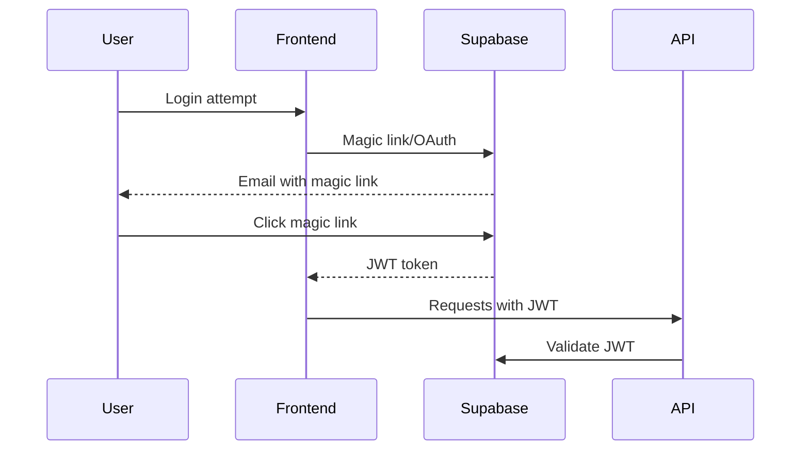
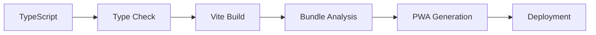

# OTA Technical Architecture

## System Overview

The OTA Tour Management Platform is a modern, offline-first web application designed for the music industry. It provides tour management capabilities for artists, DJs, managers, booking agents, and crew members.

## Architecture Principles

### 1. Offline-First Design
- **Local Storage**: IndexedDB via Dexie for complex data
- **Sync Strategy**: Background sync with conflict resolution
- **Queue Management**: Failed operations retried with exponential backoff
- **Service Worker**: Caches resources and handles offline scenarios

### 2. Multi-Tenant Architecture  
- **Organization-Based**: Data isolated by organization
- **Role-Based Access**: User permissions within organizations
- **Row Level Security**: Database-level security enforcement
- **Scalable**: Supports unlimited organizations

### 3. Progressive Web App (PWA)
- **Installable**: Native app-like experience
- **Responsive**: Mobile-first design
- **Push Notifications**: Real-time tour updates
- **Offline Capable**: Full functionality without network

## Technology Stack

### Frontend
```
TypeScript + Vite
├── Build System: Vite 5.x with hot reload
├── Type Safety: TypeScript with strict mode
├── Bundling: Rollup with tree shaking
├── CSS: PostCSS with design tokens
└── Web Components: Custom elements for reusability
```

### Backend & Infrastructure
```
Supabase + Vercel
├── Database: PostgreSQL with Row Level Security
├── Authentication: Magic links + OAuth providers
├── API: Auto-generated REST API + Realtime subscriptions
├── Storage: File uploads for documents/images
├── Functions: Serverless functions for custom logic
└── Hosting: Vercel with global CDN
```

### Offline & Caching
```
Service Worker + IndexedDB
├── App Shell: Pre-cached for instant loading
├── API Cache: Network-first with fallback
├── Data Sync: Background sync when online
├── Storage: Dexie wrapper for IndexedDB
└── Conflict Resolution: Server-wins with user notification
```

## Data Architecture

### Core Entities

#### Organizations
```typescript
interface Organization {
  id: string;
  name: string;
  type: 'artist' | 'agency' | 'label' | 'venue';
  settings: OrganizationSettings;
  created_at: Date;
}
```

#### Users & Roles
```typescript
interface User {
  id: string;
  email: string;
  profile: UserProfile;
  organizations: UserOrganization[];
}

interface UserOrganization {
  organization_id: string;
  role: 'owner' | 'admin' | 'manager' | 'crew' | 'booking';
  permissions: Permission[];
}
```

#### Shows & Events
```typescript
interface Show {
  id: string;
  organization_id: string;
  title: string;
  venue: Venue;
  date: Date;
  financial: ShowFinancial;
  logistics: ShowLogistics;
  status: ShowStatus;
}
```

### Database Schema

#### Multi-Tenancy Pattern
```sql
-- All tables include organization_id for isolation
CREATE TABLE shows (
  id UUID PRIMARY KEY DEFAULT gen_random_uuid(),
  organization_id UUID REFERENCES organizations(id),
  -- ... other fields
);

-- RLS policies enforce data isolation
CREATE POLICY "Users can only access their organization's shows"
ON shows FOR ALL
USING (organization_id IN (
  SELECT organization_id FROM user_organizations 
  WHERE user_id = auth.uid()
));
```

#### Audit & History
```sql
-- All tables have audit fields
CREATE TABLE shows (
  -- ... business fields
  created_at TIMESTAMPTZ DEFAULT NOW(),
  updated_at TIMESTAMPTZ DEFAULT NOW(),
  created_by UUID REFERENCES auth.users(id),
  updated_by UUID REFERENCES auth.users(id)
);
```

## API Architecture

### RESTful Design
```
/api/shows
├── GET    /api/shows                 # List shows (org-scoped)
├── POST   /api/shows                 # Create show
├── GET    /api/shows/:id             # Get show details
├── PUT    /api/shows/:id             # Update show
└── DELETE /api/shows/:id             # Delete show
```

### Real-time Subscriptions
```typescript
// Supabase realtime for live updates
const subscription = supabase
  .channel('shows-changes')
  .on('postgres_changes', 
    { event: '*', schema: 'public', table: 'shows' },
    (payload) => handleShowUpdate(payload)
  )
  .subscribe();
```

### Serverless Functions
```
/api/
├── shows.ts         # CRUD operations with RLS
├── sync.ts          # Bulk sync operations
├── reports.ts       # Financial reporting
└── webhooks.ts      # External integrations
```

## Security Architecture

### Authentication Flow


### Authorization Model
```typescript
interface Permission {
  resource: 'shows' | 'expenses' | 'travel' | 'users';
  actions: ('read' | 'write' | 'delete')[];
  scope: 'own' | 'organization' | 'all';
}

// Role definitions
const ROLES = {
  owner: { all_permissions: true },
  admin: { 
    shows: ['read', 'write', 'delete'],
    expenses: ['read', 'write', 'delete'],
    users: ['read', 'write']
  },
  manager: {
    shows: ['read', 'write'],
    expenses: ['read', 'write']
  },
  crew: {
    shows: ['read'],
    expenses: ['read']
  }
};
```

### Data Protection
- **Encryption**: TLS 1.3 for data in transit
- **JWT**: Signed tokens with short expiry
- **RLS**: Database-level access control
- **Input Validation**: All user inputs sanitized
- **CORS**: Restrictive cross-origin policies

## Performance Architecture

### Frontend Optimization
```
Bundle Strategy
├── Code Splitting: Route-based chunks
├── Tree Shaking: Unused code elimination
├── Compression: Gzip/Brotli compression
├── Caching: Aggressive browser caching
└── CDN: Global content delivery
```

### Database Optimization
```sql
-- Strategic indexes for common queries
CREATE INDEX idx_shows_org_date ON shows(organization_id, date);
CREATE INDEX idx_expenses_show_id ON expenses(show_id);
CREATE INDEX idx_users_email ON users(email);

-- Partial indexes for performance
CREATE INDEX idx_active_shows ON shows(organization_id, date) 
WHERE status != 'cancelled';
```

### Caching Strategy
```
Multi-Layer Caching
├── Browser Cache: Static assets (1 year)
├── CDN Cache: API responses (5 minutes)
├── Service Worker: App shell + API cache
├── IndexedDB: Offline data storage
└── Memory Cache: Hot data in components
```

## Scalability Architecture

### Horizontal Scaling
- **Stateless Functions**: Auto-scaling serverless functions
- **Database**: Supabase handles connection pooling
- **CDN**: Global edge caching via Vercel
- **Client-Side**: Reduced server load via offline-first

### Performance Targets
```
Metrics                Target
├── First Paint       < 1.5s
├── Interactive       < 3.0s
├── Bundle Size       < 500KB
├── API Response      < 200ms
└── Offline Support   100%
```

### Monitoring & Observability
```typescript
// Performance monitoring
const observer = new PerformanceObserver((list) => {
  for (const entry of list.getEntries()) {
    analytics.track('performance', {
      metric: entry.name,
      value: entry.duration,
      url: window.location.pathname
    });
  }
});
```

## Development Architecture

### Code Organization
```
src/
├── lib/              # Core services & utilities
│   ├── supabase.ts   # Database client
│   ├── offline-storage.ts  # Offline sync
│   └── auth.ts       # Authentication
├── modules/          # Feature modules
│   ├── shows/        # Show management
│   ├── finance/      # Financial tracking
│   └── travel/       # Travel coordination
├── ui/               # Reusable components
├── styles/           # Design system
└── data/             # Type definitions
```

### Build Process


### Testing Strategy
```
Testing Pyramid
├── Unit Tests: Core business logic
├── Integration Tests: API endpoints
├── E2E Tests: Critical user flows
└── Manual Tests: UX & accessibility
```

## Deployment Architecture

### CI/CD Pipeline
```yaml
# .github/workflows/deploy.yml
name: Deploy
on:
  push:
    branches: [main]
steps:
  - uses: actions/checkout@v3
  - run: npm ci
  - run: npm run type-check
  - run: npm run build
  - uses: vercel/action@v1
```

### Environment Strategy
```
Environments
├── Development: Local + hot reload
├── Staging: Vercel preview deployments
├── Production: Vercel production domain
└── Testing: Isolated Supabase project
```

### Infrastructure as Code
```typescript
// vercel.json
{
  "functions": {
    "api/**/*.ts": {
      "runtime": "@vercel/node@3.0.7"
    }
  },
  "headers": [
    {
      "source": "/api/(.*)",
      "headers": [
        { "key": "Access-Control-Allow-Origin", "value": "*" },
        { "key": "Access-Control-Allow-Methods", "value": "GET,POST,PUT,DELETE" }
      ]
    }
  ]
}
```

## Future Architecture Considerations

### Microservices Evolution
- **API Gateway**: Centralized routing & rate limiting
- **Service Mesh**: Inter-service communication
- **Event Sourcing**: Audit trail & temporal queries
- **CQRS**: Separate read/write models

### Advanced Features
- **ML/AI**: Smart scheduling & expense categorization
- **Real-time Collaboration**: Operational transforms
- **Multi-Region**: Geographic data distribution
- **Mobile Apps**: React Native with shared logic

### Technology Roadmap
```
Phase 1 (Q1 2026): MVP Foundation ✅
├── Core features
├── Basic offline support
└── Vercel deployment

Phase 2 (Q2 2026): Enhanced Features
├── Advanced analytics
├── Third-party integrations
└── Mobile optimizations

Phase 3 (Q3 2026): Scale & Performance
├── Multi-region deployment
├── Advanced caching
└── Performance optimization
```

---

This architecture provides a solid foundation for the tour management platform while maintaining flexibility for future growth and feature additions.
